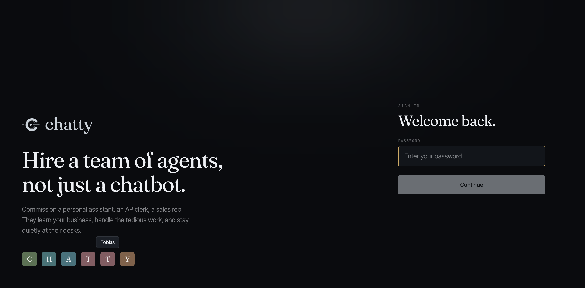
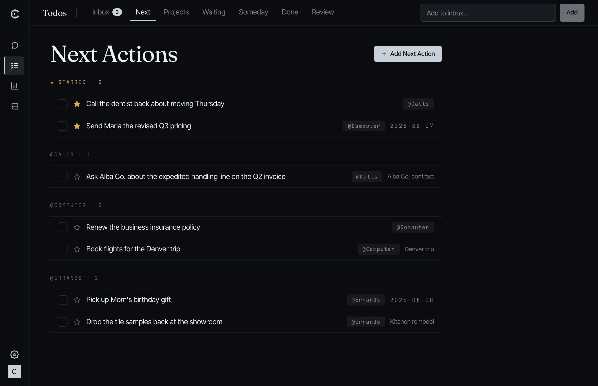
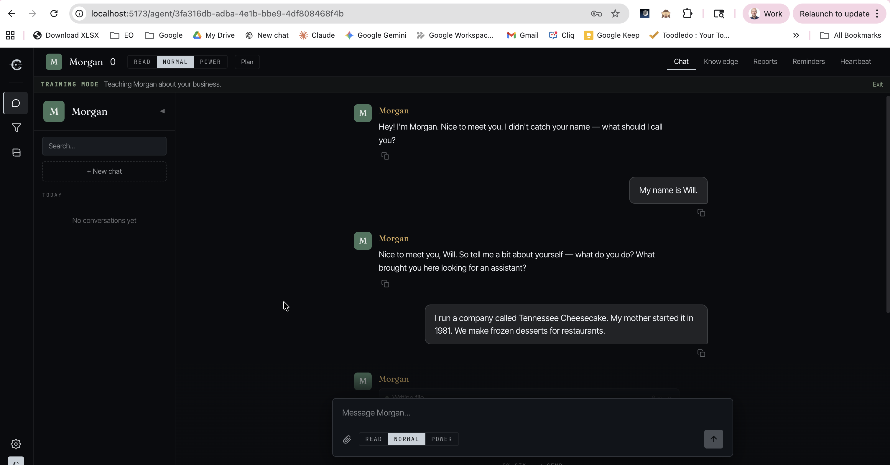

#  Chatty

**Your assistant. Your data. Your rules.**

A free, open-source personal AI assistant for business or personal use — a simple, easy, web-based agent platform, not a command-line tool. It reads your email, keeps your todos in a full GTD system, sits in on your calls, and works on a schedule. Everything it learns stays yours. Learn more at [mechatty.com](https://mechatty.com).

Everything happens in the browser: creating agents, chatting, working your todo list, connecting integrations, reviewing heartbeat schedules. Run it locally or deploy to Railway and access it from your phone, tablet, or desktop — no terminal required after setup.

Your conversations, memories, and files live in a SQLite database on your machine or your server — not in someone else's cloud. Bring your own API keys, or run entirely offline with Ollama. No SaaS fees, no vendor lock-in, no tier you get upsold to. You only pay for the AI usage you consume.

> **New to AI agents?** Read our [plain-English guide](docs/what-is-chatty.md) — no technical knowledge required.



## Features

- **Browser-based UI** — Full dashboard for managing agents, integrations, and settings — no command line needed after initial setup
- **Multi-agent** — Create and manage multiple AI agents, each with its own name, personality, and knowledge base
- **Multi-provider AI** — Anthropic, OpenAI, Google Gemini, Ollama (local models), and Together AI
- **Heartbeat** — Agents run scheduled background tasks on their own — scanning emails, checking calendars, reviewing your todo list — and notify you via browser push notifications, Telegram, or WhatsApp
- **Reminders** — Set one-time or recurring reminders (daily, weekly, monthly, cron) that trigger your agent to take action or notify you
- **Training mode** — Conversational onboarding that teaches your agent about you, your business, and how you like to work
- **Memory** — A second brain that grows as you go: facts extracted from conversations, semantic vector search, temporal fact tracking, and nightly consolidation that archives what's gone dormant
- **Conversation search** — Full-text (FTS5) search across every conversation you've ever had
- **Meeting recording** — Upload or record audio, get it transcribed, and have your agent act on what it heard. Live meetings add real-time chunked transcription with an agent coach that speaks up mid-call only when something's worth catching
- **Playbooks & learning loop** — When your agent notices you asking for the same thing repeatedly, it proposes a reusable playbook. Approve it and it becomes a slash command you can run on demand, editable like a document
- **Commitments** — Inferred follow-ups: your agent notices what you promised in email and on calls, then surfaces it before you've remembered you owe it
- **Usage & cost dashboard** — Token usage and estimated cost broken down by agent, model, and day, priced from a maintained rate table (paid models with no known rate are flagged, never silently reported as $0)
- **Knowledge import** — Import an existing agent from [OpenClaw](https://github.com/claw-project/openclaw) or paste context from any AI tool to bootstrap a new agent in minutes
- **Todos (GTD)** — A full Getting Things Done system built in, not an integration: inbox, next actions by context, projects, waiting/delegated tracking, and a weekly review — with capture from your phone, from Telegram, or by your agent. [See below](#todos-gtd)
- **Integrations** — Gmail (multiple accounts), Google Calendar, Google Drive, QuickBooks Online, Todoist, Telegram (multiple bots), Odoo, BambooHR, Paperclip, and CRM Lite (optional, off by default). WhatsApp is deprecated/frozen — use Telegram
- **Agent orchestration** — Connect to [Paperclip](https://github.com/paperclipai/paperclip) for org charts, task management, and multi-agent coordination
- **File uploads** — Drag and drop PDFs, DOCX, and text files into chat for your agent to read and analyze
- **Two-factor auth** — Optional TOTP-based 2FA for your login
- **Brandable** — Upload your logo, company name, and accent color to make it yours
- **BYO OAuth** — Bring your own Google and QuickBooks OAuth credentials for full control over your integration apps
- **Local-first** — SQLite database, no external services required
- **One-click deploy** — Deploy to Railway for access from any device

## Todos (GTD)

Chatty ships a full [Getting Things Done](https://gettingthingsdone.com/) system as a **core, always-on feature** — not an integration you have to enable. The hard part of GTD was never the method, it was keeping the list honest. Your agents do the upkeep.

**The pages** live under `/todos`: Inbox, Next Actions, Projects, Waiting, Someday, Done, and a Review page that flags anything untouched for 14+ days.

**The seven statuses** mirror GTD properly: `inbox`, `next_action`, `waiting_for`, `delegated`, `someday_maybe`, `done`, `dropped`. Todos carry a context (`@Calls`, `@Errands`), optional tags, and an optional project.

**Capture from anywhere:**

| Method | How it works |
|---|---|
| `/capture` page | A no-login, mobile-first page you bookmark on your phone — type or dictate, hit send, it's in your inbox. Like the todo link, it ships a web app manifest, so **Add to Home Screen** installs it as a full-screen app with its own icon. If your instance is reachable from the public internet, turn on the secret-token option in **Settings → Todos** |
| Telegram | Message your bot `capture buy milk` — a deterministic intercept logs it instantly with zero AI processing, so it's fast and costs nothing |
| Your agent | 11 `todo_*` tools let any agent create, triage, complete, and reorganize todos as part of a normal conversation |
| The UI | Add and edit directly at `/todos` |

### The no-login todo link — your list as an app

The todo link puts the whole todo app on its own page at `/todo`, outside the dashboard — no password, no session, just your list. Turn it on in **Settings → Todos**, copy the link, and open it on your phone.

**How the access model works.** Instead of a login, the link itself is the key. When you enable it, Chatty mints a long random secret and serves the app only at `/todo/<secret>` — the same "anyone with the link" model as a shared Google Doc, and the same one the `/capture` page uses. For you it's zero friction: tap the bookmark and you're in, nothing to type, nothing that expires. For everyone else it's closed: the URL is unguessable, wrong guesses get a plain 404 and are rate-limited, and the page tells search engines not to index it. If the link ever leaks, hit **Regenerate secret** in Settings and the old one goes dead instantly. (You *can* switch the secret off and serve it at plain `/todo`, but then anyone who knows your server address can read and edit your todos — only do that on a network you trust.)

**Install it like an app.** The page ships a [web app manifest](https://developer.mozilla.org/en-US/docs/Web/Progressive_web_apps/Manifest), so your phone treats it as installable rather than as a mere bookmark:

1. Open your todo link on your phone.
2. **iPhone**: Share → **Add to Home Screen**. **Android**: menu (⋮) → **Add to Home screen** / **Install**.
3. You get a "Todos" icon on your home screen. Tapping it opens your list **full-screen with no browser chrome at all** — no address bar, no tabs — and it appears in your app switcher as its own app.

Because the manifest bakes your secret URL in as the app's start URL, the installed app always launches straight into your authenticated list — the secret becomes an invisible, installed credential. A nice side effect of losing the address bar: your secret is never displayed on screen. There's no app store and nothing to update; it's the same web page, so changes arrive on next launch. One thing to know: the installed app is pinned to the secret it was installed with, so after **Regenerate secret** you'll need to remove and re-add it from the new link.

**GTD coaching** is injected into every agent's system prompt so they handle your list the GTD way rather than improvising. The text is editable in **Settings** (`gtd_coaching_text`), and agents can propose updates to it themselves via `todo_update_gtd_coaching`. Clearing it disables the coaching block.



## Quick Start

```bash
git clone https://github.com/WWilson1017/chatty.git
cd chatty
python run.py
```

The launcher checks prerequisites, creates a virtual environment, installs dependencies, and starts the server. Open **http://localhost:8000** when it's ready.

### Requirements

- Python 3.10+
- Node.js 18+

### Configuration

Copy `.env.example` to `.env` and fill in your credentials:

- **`AUTH_PASSWORD`** — Your login password
- **`JWT_SECRET`** — A random secret for session tokens (auto-generated by `run.py`)
- **AI provider** — At least one of: Anthropic API key, OpenAI API key, Google AI API key, or a local Ollama instance (free)

See `.env.example` for all available options including integrations.

### Using Ollama (free, local models)

Run AI models on your own hardware with no API key or usage fees:

1. Install [Ollama](https://ollama.com)
2. Pull a tool-capable model: `ollama pull llama3.1`
3. Start Chatty with `python run.py` — select Ollama in the setup wizard

**Recommended models** (support tool calling for full Chatty features):

| Model | Pull command | Notes |
|-------|-------------|-------|
| Llama 3.1 | `ollama pull llama3.1` | Great all-around choice |
| Qwen 2.5 | `ollama pull qwen2.5` | Fast, good for smaller hardware |
| Mistral | `ollama pull mistral` | Solid alternative |
| Phi-4 | `ollama pull phi4` | Microsoft's compact model |

Models without tool support will still chat but won't have access to memory, search, or integrations.

### CLI test harness

Chatty is a browser app, but there's a terminal REPL for chatting with your agents without starting the web server — useful for testing and debugging:

```bash
cd backend && ../.venv/bin/python -m cli
```

Useful flags: `--agent <slug>` to pick an agent, `--list` to see them all, `--ephemeral` to skip saving the conversation, `--readonly` to disable write tools, `--power` to skip write confirmations, `-v` for full tool args and results. Inside the REPL, `/help` lists the slash commands (`/search`, `/memory`, `/context`, `/usage`, `/agents`, `/switch`, and more).

## Import from OpenClaw

If you're already using [OpenClaw](https://github.com/claw-project/openclaw), you can import your agent's knowledge directly into Chatty — no copy-pasting, no re-training. Chatty detects your local OpenClaw installation, lists your agents, and imports their workspace files automatically. Your new Chatty agent starts with everything your OpenClaw agent already knows.

1. Create a new agent in Chatty
2. Chatty detects OpenClaw on your machine and offers to import
3. Pick which OpenClaw agent to import from
4. Your agent is ready — personality, knowledge, and context all carry over

This works because both platforms store agent knowledge as markdown files. Chatty reads your OpenClaw workspace directly and scrubs out system-level details, keeping only the knowledge that matters.



## Jumpstart Your Agent from Any AI Tool

No OpenClaw? No problem. You can bootstrap a new Chatty agent from any existing AI conversation.

**Export from an existing AI agent.** If you have an agent on another platform (ChatGPT, Claude, etc.), ask it to create a markdown knowledge file summarizing what it knows about you — your role, your business, your preferences, how you like to work. Then paste that file into a Chatty conversation and your new agent is caught up immediately.

You can tailor the export to fit the new agent's purpose. For example, if your existing agent is a business assistant but you're setting up a personal agent in Chatty, tell it to leave out work-specific details and focus on personal preferences. Going the other direction, ask it to emphasize business context. You can also ask it to include a list of questions where it has gaps, so your new agent knows what to ask you about.

**No existing agent? Use any AI chat.** Open ChatGPT, Claude, or any AI assistant and ask it something like: *"Search your memory and our conversation history, then create a markdown knowledge file I can give to a new AI agent that explains who I am, what I do, what's important to me, and how I like to work."* Paste the result into Chatty and you've got a head start.

## Scheduled Actions & Heartbeat

Your agents can work on their own on a schedule. There are two kinds of background work, and they deliver results differently — by design:

- **Scheduled actions (cron)** — *report* tasks, like a 5:15 AM "morning brief." These run on a cron schedule and their output is **always delivered to you** — via browser push, Telegram, WhatsApp, and the in-app notification log. Delivery is **guaranteed by Chatty itself, not by the model**: the agent just writes its report as its final response and the system sends it. (If a run genuinely has nothing to report, the agent can reply with exactly `[SILENT]` to skip that one delivery.)
- **Heartbeat** — a *monitor* task that runs periodically (e.g. every 30 minutes) against a checklist in the agent's `HEARTBEAT.md`. It uses the **same delivery guarantee**: if the heartbeat finds something (`ACTION_TAKEN: …`), Chatty delivers it; if nothing new needs attention the agent replies `HEARTBEAT_OK` and stays silent. Cheap triage and the checklist skip most ticks before they ever run, and the agent reports only what's *new* — so you're not spammed.
- **Reminders** — one-time or recurring nudges that trigger the agent to act or notify you.

> **Why the guarantee matters:** a scheduled task's whole purpose is to reach you. Earlier versions relied on the AI choosing to call a notification tool, so a model change could silently swallow a brief. Chatty now delivers a scheduled action's output (cron *and* heartbeat) as a system step regardless of model behavior — the only suppressor is the agent explicitly going silent (`[SILENT]` / `HEARTBEAT_OK`). **Contributors:** keep delivery in the processor (`backend/core/agents/scheduled_actions/processor.py`) — don't move it back into model-prompt instructions. See `docs/solutions/architecture-patterns/scheduled-action-guaranteed-delivery.md`.

## Integrations

Chatty connects to your existing business tools so your agents can answer questions, look up data, and take action on your behalf.

| Integration | Setup | What your agent can do |
|---|---|---|
| [Gmail](docs/gmail-setup.md) | Google OAuth — see [setup guide](docs/google-oauth-setup.md) | Search, read, send, reply to, and draft emails. Connect multiple Gmail accounts and assign them per agent |
| [Google Calendar](docs/google-calendar-setup.md) | Google OAuth — see [setup guide](docs/google-oauth-setup.md) | View, create, update, and delete calendar events |
| [Google Drive](docs/google-drive-setup.md) | Google OAuth — see [setup guide](docs/google-oauth-setup.md) | Search, read, and upload files |
| [QuickBooks Online](docs/quickbooks-setup.md) | Intuit OAuth — see [setup guide](docs/quickbooks-setup.md) | Invoices, estimates, payments, customers, vendors, and financial reports |
| [QuickBooks CSV](docs/quickbooks-csv-setup.md) | One-click | Analyze exported QuickBooks CSV files — no OAuth required |
| [CRM Lite](docs/crm-lite-setup.md) | One-click (optional, off by default) | Manage contacts, deals, tasks, and activities — enable it in Settings → Integrations if you want a lightweight CRM |
| [Telegram](docs/telegram-setup.md) | Bot token | Chat with your agent from Telegram. Each agent gets its own bot; one user can talk to multiple agents |
| [WhatsApp](docs/whatsapp-setup.md) | QR code scan | Chat with your agent from WhatsApp — **deprecated and frozen** (no new development; use Telegram). Existing setups keep working |
| [Todoist](docs/todoist-setup.md) | API token | Create, manage, complete, and organize tasks and projects |
| [Odoo](docs/odoo-setup.md) | API key | Sales, inventory, accounting, HR, and more from your Odoo ERP |
| [BambooHR](docs/bamboohr-setup.md) | API key | Employee directory, time off, and HR data |

## Deploy to Railway

[](https://railway.com/deploy/chatty?referralCode=HMgK-M)

1. Click the button above and set your `AUTH_PASSWORD` (the only required input)
2. Railway builds and deploys your instance automatically
3. Open your Chatty URL, log in, and paste your AI provider API key in the setup wizard

`JWT_SECRET` and `ENCRYPTION_KEY` auto-generate if not set. Your data persists on a Railway volume.

For detailed instructions, custom domains, and troubleshooting, see [DEPLOY.md](DEPLOY.md).

## Agent Orchestration with Paperclip

Run a coordinated team of AI agents with [Paperclip](https://github.com/paperclipai/paperclip) — the open-source orchestration control plane for AI agent companies.

Chatty gives each agent a brain. Paperclip gives the team structure: **org charts**, **task assignments**, **budget tracking**, and **governance**. Together, your agents can assign work to each other, track progress through issues, and communicate through structured task threads.

[](https://railway.com/deploy/ZLeQVd?referralCode=HMgK-M)

**Getting started:**

1. Deploy Paperclip on Railway (button above) and create your company
2. In Chatty, go to **Settings** > **Integrations** > **Paperclip** and sign in with your Paperclip credentials
3. Map your Chatty agents to Paperclip agents
4. Chat with any agent: *"Check Paperclip for my tasks"*

Your agents get tools to list issues, claim tasks, update status, and post comments — all from within the chat. Paperclip can also trigger agents automatically via heartbeat webhooks.

For the full setup guide, see [PAPERCLIP.md](PAPERCLIP.md).

## Contributing

See [CONTRIBUTING.md](CONTRIBUTING.md) for how to submit changes.

## Security

To report a security vulnerability, see [SECURITY.md](SECURITY.md).

## License

[MIT](LICENSE)
